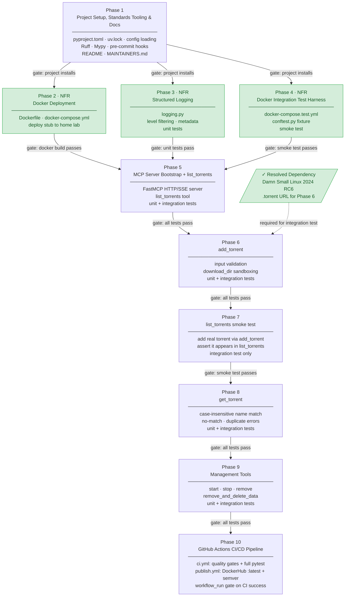

# Construction Workflow Plan

Generated during INCEPTION — Workflow Planning phase.
Approved requirements: `aidlc-docs/inception/requirements/requirements.md`

---

## Guiding Principles

- **NFRs before functional work** — non-functional requirements (deployment, logging, test infrastructure) are established before any MCP tool logic is built
- **Prod or it didn't happen** — the production Docker deployment artefact is created immediately after project setup; every subsequent phase ships to a live environment
- Integration tests run against real Transmission via Docker — feasibility is **unknown** and treated as high risk; de-risked in Phase 4 before any tool logic is built
- Unit tests mock all `transmission-rpc` calls; written continuously alongside each feature
- **Gate rule**: a phase is NOT complete unless all unit and integration tests pass
- `add_torrent` integration tests require a public `.torrent` URL — **resolved**: Damn Small Linux 2024 RC6 (see Deferred Dependencies)

---

## Construction Phases

### Phase 1 — Project Setup, Standards Tooling & Documentation

**Goal**: Establish the project skeleton, dependency manifest, config loading, all quality tooling, and developer documentation. All standards tooling must be operational before any Python source code is written.

**Deliverables**:
- `pyproject.toml` with `uv` and all pinned dependencies:
  - `fastmcp` (latest)
  - `transmission-rpc==7.0.11`
  - `pytest` (latest, dev)
  - `pytest-asyncio` (latest, dev)
  - `pytest-cov` (latest, dev)
  - `ruff` (latest, dev)
  - `mypy` (latest, dev)
  - `pre-commit` (latest, dev)
- `uv.lock` committed
- Ruff configuration in `pyproject.toml`:
  - `[tool.ruff]` — `line-length = 120`
  - `[tool.ruff.lint]` — rules: `E`, `W`, `F`, `I`, `UP`, `B`
  - `[tool.ruff.format]` — line length and quote style
- Mypy configuration in `pyproject.toml`:
  - `[tool.mypy]` — standard mode
- `.pre-commit-config.yaml`:
  - Hook 1: `ruff format`
  - Hook 2: `ruff check`
  - Hook 3: `mypy`
- Project source layout:
  ```
  src/transmission_mcp/
      __init__.py
      config.py       # TOML config loading
      server.py       # FastMCP app entrypoint (stub)
  tests/
      unit/
          __init__.py
      integration/
          __init__.py
  ```
- `config.toml.example` with all required keys (`[transmission]`, `[server]`, `[logging]`)
- TOML config loading (`tomllib` stdlib) with typed dataclass or namedtuple
- `pytest.ini` or `[tool.pytest.ini_options]` in `pyproject.toml`
- `MAINTAINERS.md` with all `uv` developer commands:
  - Setup: install `uv`, create venv, install deps, install pre-commit hooks
  - Running the server: `uv run python -m transmission_mcp`
  - Running unit tests: `uv run pytest tests/unit/`
  - Running integration tests: `uv run pytest tests/integration/`
  - Running all quality checks manually: `uv run ruff format .`, `uv run ruff check .`, `uv run mypy src/`
  - Adding dependencies: `uv add <package>`
  - Upgrading dependencies: `uv lock --upgrade`
- `README.md` with project description, quick-start, and config reference

**Gate**: `uv run pytest` exits 0; `uv run ruff check .` exits 0; `uv run mypy src/` exits 0; pre-commit hooks installed and passing on a test commit.

---

### Phase 2 — Docker Deployment (NFR)

**Goal**: Ship the production deployment artefact immediately after project setup so the server can be deployed to the home lab and updated continuously as features are added.

**Deliverables**:
- `Dockerfile` (Python 3.13+, installs with `uv`, runs the MCP server stub)
- `docker-compose.yml` (MCP server only; Transmission is external)
- Confirm `uv.lock` is committed

**Gate**: `docker build` succeeds; `docker compose up` starts the stub server.

---

### Phase 3 — Structured Logging (NFR)

**Goal**: Implement the logging subsystem so all subsequent phases can log from day one.

**Deliverables**:
- `src/transmission_mcp/logging.py`:
  - Every log entry has `severity`, `message`, `metadata` (key/value pairs)
  - Severity levels: `trace`, `debug`, `info`, `warning`, `error`, `critical`
  - Log level read from config; entries below configured level are suppressed
  - Logs to stdout
- Unit tests for the logging module:
  - Correct level filtering
  - Output includes all required fields
  - Metadata is included when provided

**Gate**: All unit tests pass.

---

### Phase 4 — Docker Integration Test Harness (NFR)

**Goal**: De-risk the Docker-based Transmission integration test infrastructure before any tool logic is built. This is the highest-risk unknown in the project.

**Deliverables**:
- `docker-compose.test.yml` (Transmission only, for test use)
- `tests/integration/conftest.py`:
  - Pytest fixture that starts a Transmission Docker container before the session and tears it down after
  - Fixture returns a live `transmission-rpc` client connected to the container
- One smoke-test that asserts the connection to Transmission succeeds (e.g. can fetch session info)

**Gate**: `uv run pytest tests/integration/` exits 0; smoke-test passes against Docker Transmission.

---

### Phase 5 — MCP Server Bootstrap & `list_torrents`

**Goal**: Get a running FastMCP server over HTTP/SSE with the first tool implemented end-to-end.

**Deliverables**:
- FastMCP server wired to HTTP/SSE transport, host/port from config
- `list_torrents` MCP tool:
  - Returns all torrents sorted by date added (oldest first)
  - Fields: `added_on` (ISO 8601 string or null), `name`, `size` (human-readable), `progress` ("73.5%"), `status`, `seeds` (connected seeders/total known seeders e.g. "4/12"), `peers` (connected leechers/total known leechers e.g. "2/8"), `download_speed` (human-readable e.g. "3.2 MB/s"), `upload_speed` (human-readable e.g. "1.1 MB/s"), `eta` ("HH:MM:SS" or "N/A")
  - Seeds: peers with 100% progress / max tracker seeder count; Peers: peers below 100% / max tracker leecher count — matching Transmission's desktop client columns
  - Empty list case: returns `[]` with message "No torrents found"
- Logging: every tool invocation logged at `info`; return values at `debug`; Transmission errors at `error`
- Unit tests: mock `transmission-rpc`, cover normal case, empty list, Transmission error pass-through
- Integration tests: call `list_torrents` against Docker Transmission

**Gate**: All unit and integration tests pass.

---

### Phase 6 — `add_torrent`

**Goal**: Implement torrent addition with input validation and directory sandboxing. Implementing this before `get_torrent` allows integration tests to populate Transmission with known torrents, enabling richer testing of all subsequent lookup and management tools.

**Integration test torrent**: Damn Small Linux 2024 RC6 — `https://linuxtracker.org/download.php?id=9a9f19345e31afd1dc9a5caaedf7982459900498&f=Damn+Small+Linux+2024+RC6+ISO.torrent&key=6c2d037a`

**Deliverables**:
- `add_torrent` MCP tool:
  - Accepted inputs: magnet links (`magnet:?xt=...`) or HTTP/HTTPS URLs (`.torrent`)
  - Input validation before contacting Transmission: magnet links must be well-formed (`magnet:` scheme with at least one `xt=urn:...` parameter); HTTP/HTTPS URLs must be well-formed but are not scrutinised further — path, filename, and content type are not inspected
  - Optional `download_dir` parameter:
    - If `transmission-rpc` exposes session default dir: enforce that `download_dir` is within it (path prefix check); reject paths outside with clear error
    - If not accessible: skip check, accept any path
  - Start behaviour: respect Transmission's session "start when added" setting if accessible; otherwise start immediately
  - Success response:
    - HTTP/HTTPS URL: confirmation + torrent name, status, size (after Transmission resolves)
    - Magnet link: simple confirmation only ("Torrent added successfully")
  - Duplicate handling: silent success (Transmission rejects duplicates; pass error through per FR-05 if it surfaces)
- Unit tests: mock `transmission-rpc`, cover magnet valid, URL valid, invalid input, download_dir in-bounds, download_dir out-of-bounds, duplicate (silent success)
- Integration tests: requires deferred torrent URL; tests actual add against Docker Transmission

**Gate**: All unit and integration tests pass.

---

### Phase 7 — `list_torrents` Integration Smoke Test

**Goal**: Now that `add_torrent` is implemented, add an integration test that adds a real torrent and confirms it appears in `list_torrents` results. This exercise is intentionally narrow — the torrent's download progress, seeders, peers, and speeds are non-deterministic — so the test only asserts presence, not field values.

**Deliverables**:
- New integration test in `tests/integration/` that:
  1. Adds the DSL torrent via `add_torrent` (HTTP/HTTPS URL)
  2. Calls `list_torrents`
  3. Asserts the returned list contains at least one entry whose `name` matches the added torrent (case-insensitive)
- No changes to production code — test-only phase
- Existing unit tests for `list_torrents` are unchanged

**Gate**: New integration test passes; all existing unit and integration tests continue to pass.

---

### Phase 8 — `get_torrent`

**Goal**: Implement single-torrent lookup with name matching semantics. With `add_torrent` already available, integration tests can add a known torrent and immediately verify lookup behaviour.

**Deliverables**:
- `get_torrent` MCP tool:
  - Lookup: case-insensitive exact name match
  - Returns all `list_torrents` fields plus: `save_path`, `ratio` ("1.24"), `files` (name, human-readable size, progress %), `error_message` (string or null)
  - No match: error `"No torrent found matching '[name]'"`
  - Duplicate match: error listing each match with `added_on` and `size`
- Unit tests: mock `transmission-rpc`, cover normal match, no match, duplicate match, case-insensitivity
- Integration tests: verify lookup against Docker Transmission

**Gate**: All unit and integration tests pass.

---

### Phase 9 — Torrent Management Tools (`start`, `stop`, `remove`)

**Goal**: Implement the four management operations that act on existing torrents.

**Deliverables**:
- `start_torrent` MCP tool (starts/resumes by name; case-insensitive)
- `stop_torrent` MCP tool (stops/pauses by name; case-insensitive)
- `remove_torrent` MCP tool (removes torrent, keeps downloaded data; by name)
- `remove_torrent_and_delete_data` MCP tool (removes torrent + deletes data; by name)
- All tools: pass Transmission errors through verbatim (FR-05)
- All tools: return clear success message
- All tools: name resolution follows same case-insensitive exact-match rules as `get_torrent` (no-match and duplicate errors reuse same patterns)
- Unit tests: mock `transmission-rpc`, cover success, no-match, duplicate, Transmission error
- Integration tests: against Docker Transmission

**Gate**: All unit and integration tests pass.

---

### Phase 10 — GitHub Actions CI/CD Pipeline

**Goal**: Automate quality gates, test execution, and Docker image publication via GitHub Actions so every push to `main` is validated and the image delivered to DockerHub without manual intervention.

**Deliverables**:
- `.github/workflows/ci.yml`:
  - Triggers: push to `main`, push of `v*` tags, pull requests targeting `main`
  - `quality` job: runs `ruff format --check .`, `ruff check .`, `mypy src/`
  - `test-unit` job (requires `quality`): runs `uv run pytest tests/unit/`
  - `test-integration` job (requires `quality`, `timeout-minutes: 15`): runs `uv run pytest tests/integration/` — Docker-dependent; timeout guards against container or network hangs
  - Uses `astral-sh/setup-uv` with Python `3.13` and uv dependency caching
- `.github/workflows/publish.yml`:
  - Trigger: `workflow_run` (CI workflow, type `completed`) — never runs on a failed CI
  - `publish-latest` job: fires when `head_branch == 'main'`; pushes `:latest` to DockerHub
  - `publish-release` job: fires on `push` events (excludes PRs); uses `git tag --points-at <head_sha>` after `git fetch --tags` to detect any `v*` tag at the triggering commit — this is source-of-truth reliable, unlike `head_branch` which reflects the source branch rather than the tag on `workflow_run` events; derives and pushes `:x.y.z`, `:x.y`, `:x`; remaining steps skipped if no tag found
  - Both jobs check out the triggering commit by `head_sha`, use `docker/setup-buildx-action`, log in via `DOCKERHUB_USERNAME` / `DOCKERHUB_ACCESS_TOKEN` secrets, and build with `docker/build-push-action`
  - Platform: `linux/amd64`; uses GitHub Actions cache for Docker layer caching

**Gate**: Both workflow files are syntactically valid YAML; CI runs successfully on push to `main`; Publish runs and image appears in DockerHub after CI passes.

---

## Phase Dependency Graph



Phases 2, 3, and 4 are all NFR phases that run in parallel after Phase 1 — all three must complete before Phase 5 begins. Phases 5 through 9 are strictly sequential functional work.

---

## Deferred Dependencies

| Phase | Item | Status |
|---|---|---|
| 6 | Small public torrent URL for integration test | **Resolved** — see below |

### Phase 6 Integration Test Torrent

- **Name**: Damn Small Linux 2024 RC6
- **URL**: `https://linuxtracker.org/download.php?id=9a9f19345e31afd1dc9a5caaedf7982459900498&f=Damn+Small+Linux+2024+RC6+ISO.torrent&key=6c2d037a`
- **Use**: HTTP/HTTPS `.torrent` URL input path in `add_torrent` integration test
